# 概念データモデル

## 本書について

本書は、Sample生命保険株式会社 個人保険新契約システムが扱う業務上の概念(エンティティ)と、その関連を整理したドキュメントです。プロダクト要求仕様書(PRD)およびドメイン要求仕様書群を上流とし、下流の論理 ER 図・テーブル定義(D3)の起点となります。

本書は概念レベルに留まり、格納方法(テーブル・カラム・データ型・キー設計・正規化 等)には踏み込みません。エンティティは、ドメイン定義書に定義された全ドメインを対象に、各ドメイン要求仕様書の §データアクセス要求・§業務状態遷移・§業務ルール から抽出しています。

外部システムが正典となる概念(商品・特約仕様、募集人、引受基準、本人確認書類、反社会的勢力情報)は、本システムが保有する概念と区別するため、エンティティ名の末尾に `(外部)` を付し、保有区分を「外部参照」としています。

> ⚠️ **要確認**: 契約成立(計上)完了後の契約保全は既存契約管理システム(EXT-3)の責務であるため、成立契約の正典は計上完了時点で外部へ移ります。本書では新契約プロセス内で生成・確定される概念として「成立契約」を本システム保有として扱っていますが、計上完了後の正典移管の表現方法(別エンティティとして外部参照を立てるか否か)は業務側の確認が必要です。

## 全体概念モデル図

全体図は、意向把握から保険証券発行に至る業務の骨格をなすエンティティと、それらを支える横断エンティティ(顧客・募集コンプライアンス証跡・監査ログ)に絞って描いています。ここに現れないエンティティおよび各ドメイン内の詳細な関連は §ドメイン別概念モデル図 に委ねます。

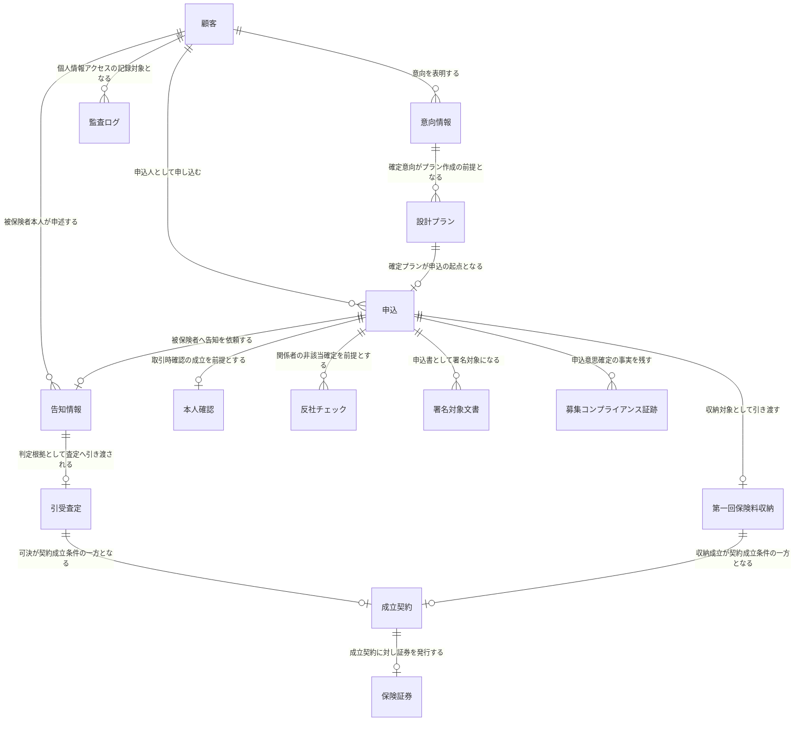

## ドメイン別概念モデル図

### 意向把握

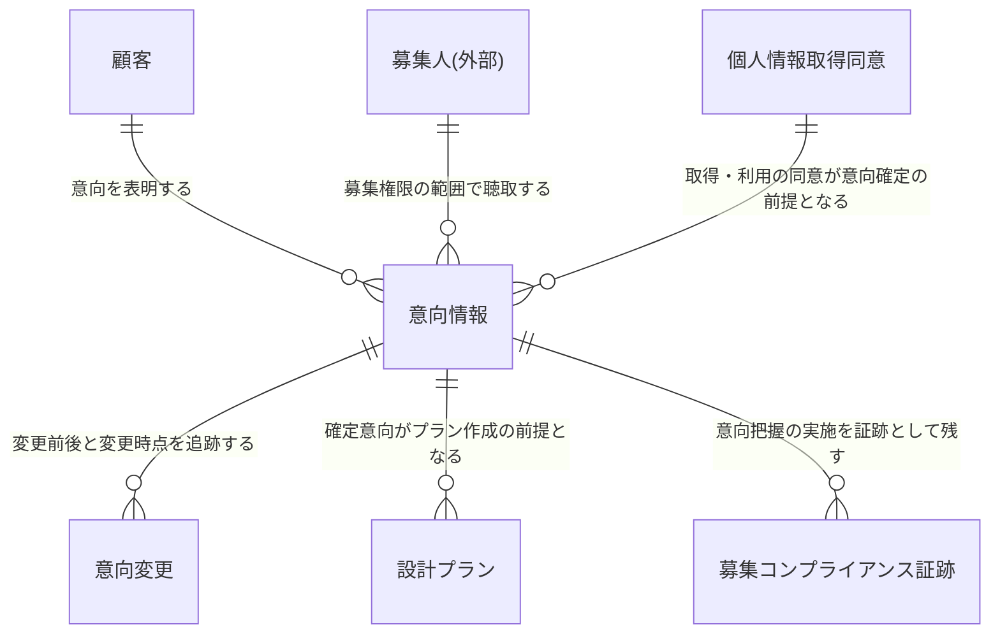

### 設計書作成

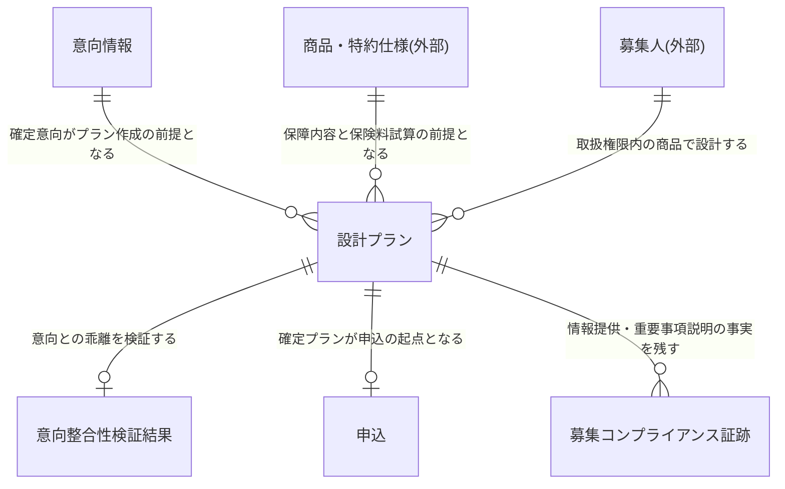

### 申込受付

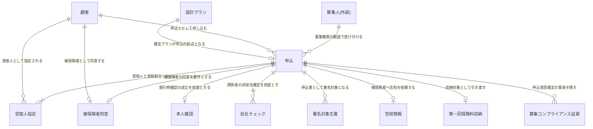

### 告知受付

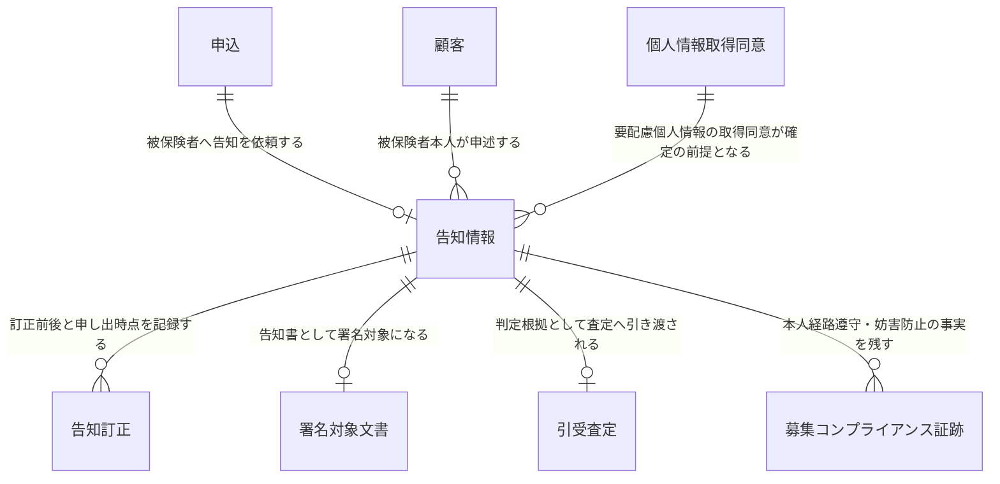

### 引受査定

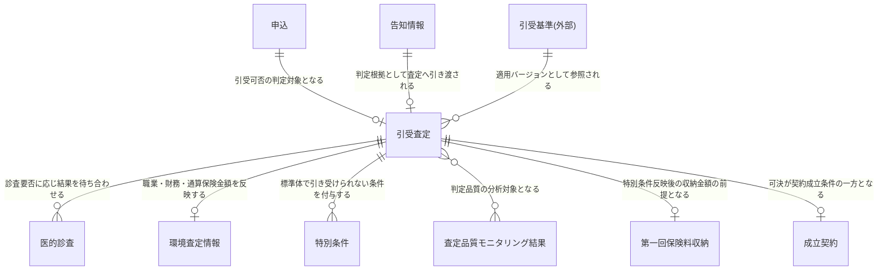

### 第一回保険料収納

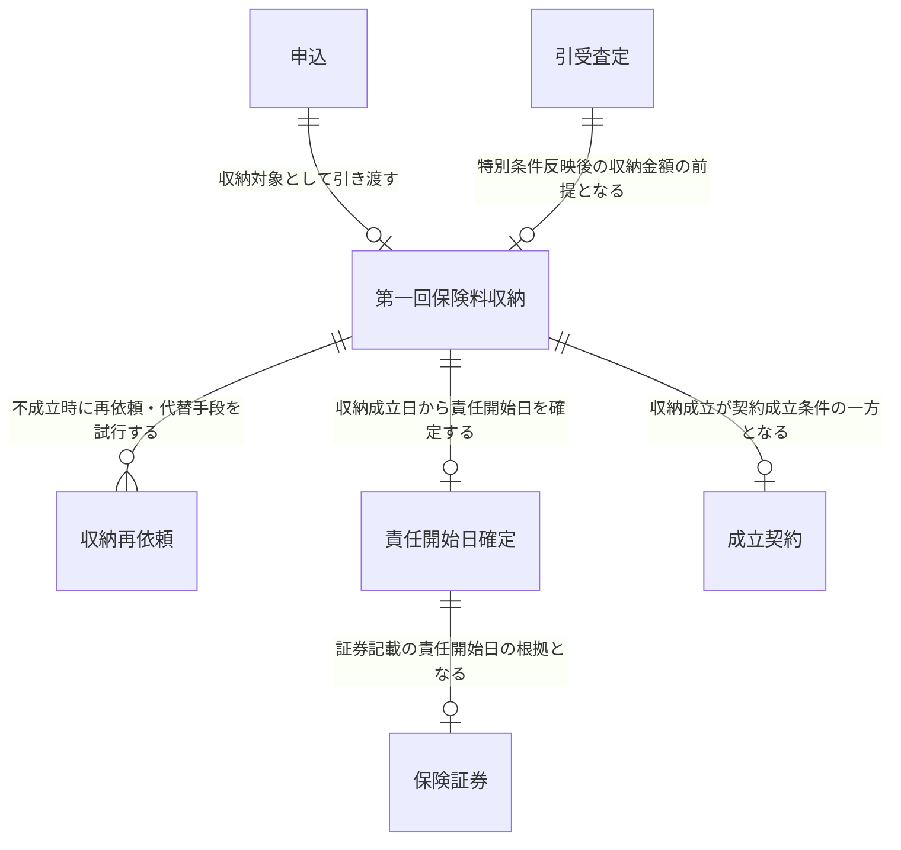

### 契約成立(計上)

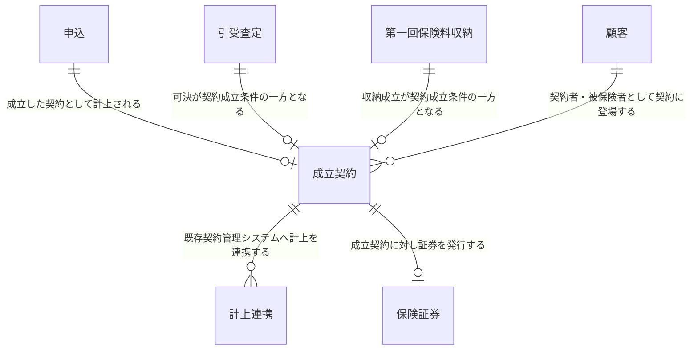

### 保険証券発行

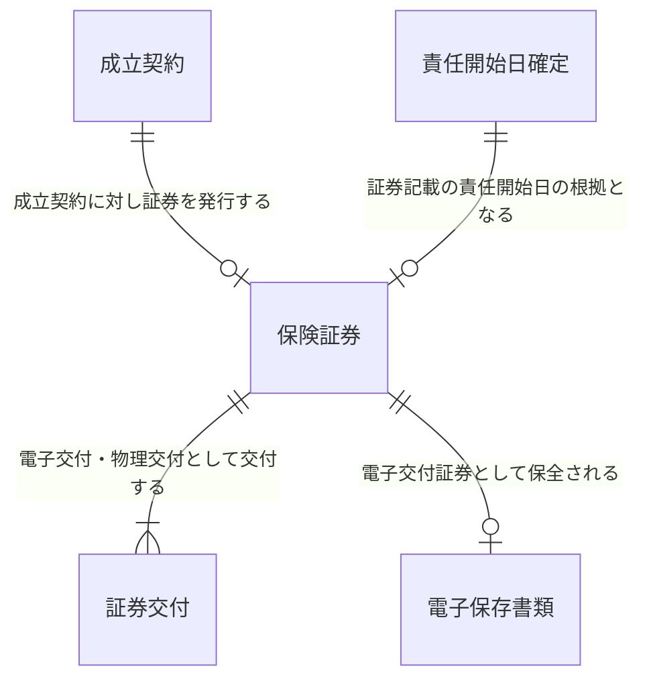

### 顧客情報管理

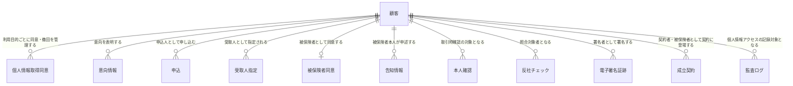

### 募集コンプライアンス証跡管理

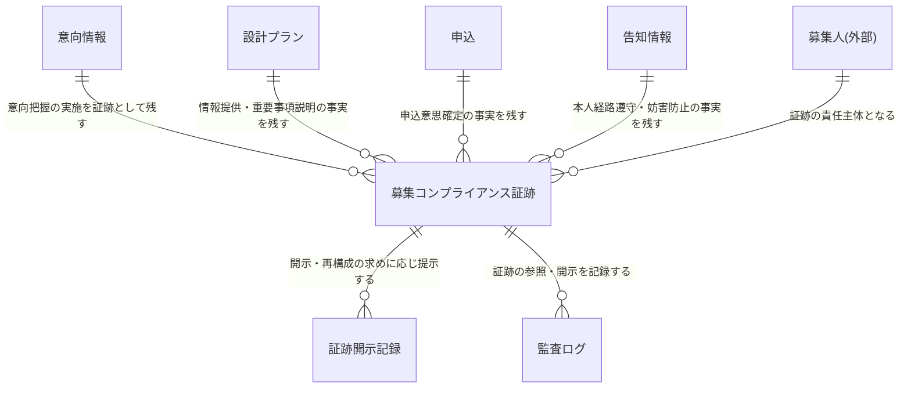

### 本人確認(KYC)

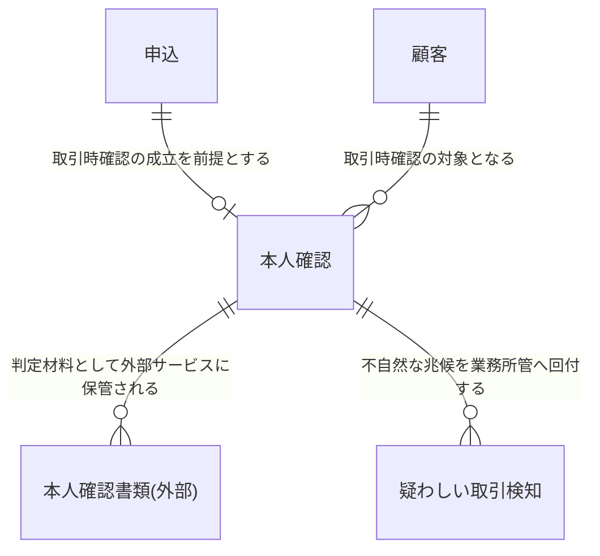

### 反社チェック

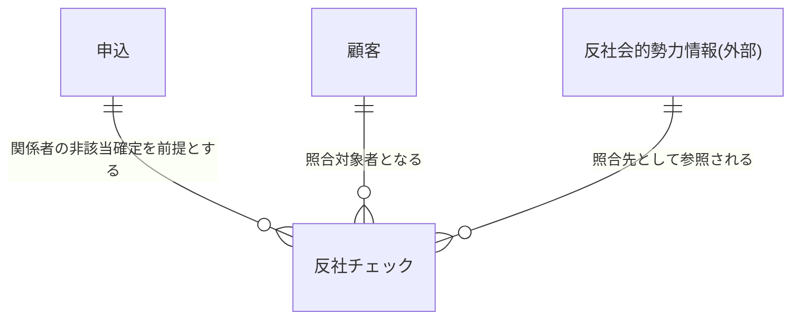

### 電子署名

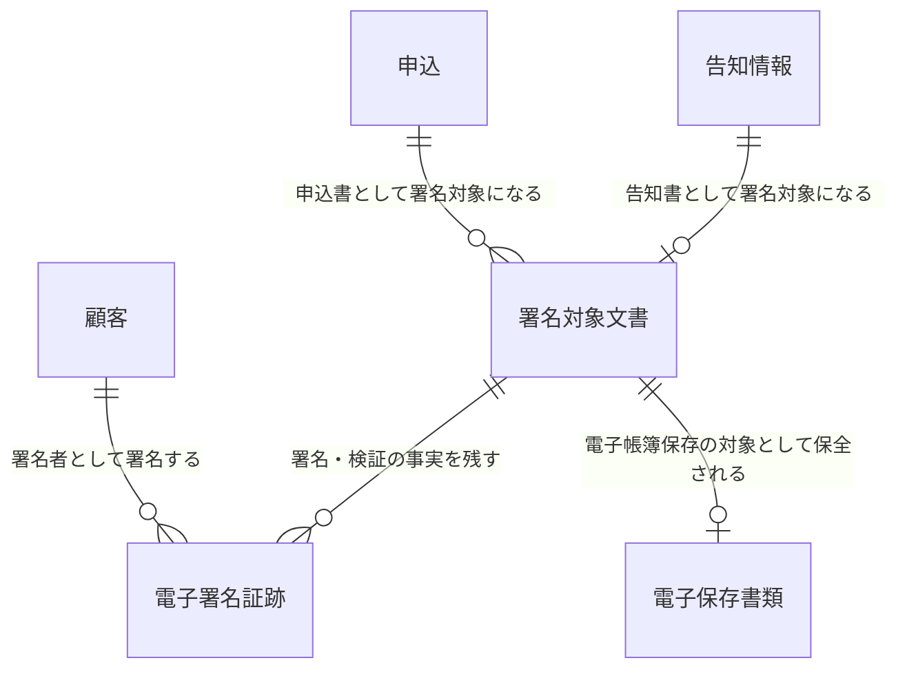

### 統制・証跡管理(アクセス制御・監査ログ・電子帳簿保存)

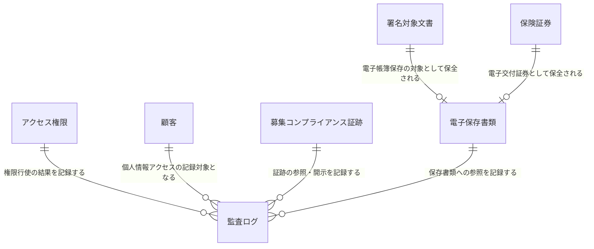

## 概念エンティティ一覧

| ID | ドメイン | エンティティ名 | 区分 | 保有区分 | 定義 | 主な属性(概念) | 関連要求 ID |
|---|---|---|---|---|---|---|---|
| CDM-1 | 意向把握: DOM-HEAR | 意向情報 | イベント | 本システム | 顧客から聴取した保険加入の意向。加入目的・希望保障・予算・既契約状況等を一体で保持し、確定後に設計書作成へ引き渡される | 加入目的・希望保障(種類/保障額/保障期間)・保険料予算・既契約状況・家族構成・職業・意向業務状態 | DOM-HEAR-DATA-1・DOM-HEAR-BR-1・DOM-HEAR-BR-2 |
| CDM-2 | 意向把握: DOM-HEAR | 意向変更 | イベント | 本システム | 確定済み意向に対して発生した修正・追加・撤回の事実。設計書提示後の意向変更も含め、どの意向に基づき設計したかを事後に説明する根拠となる | 変更前内容・変更後内容・変更時点・変更事由 | DOM-HEAR-DATA-2・DOM-HEAR-BR-3 |
| CDM-3 | 設計書作成: DOM-DESIGN | 設計プラン | イベント | 本システム | 確定意向に基づき作成された保障内容・保険料試算結果・払込前提の一式。別名「設計書」。確定済みのプランのみが申込の起点となりうる | プラン番号・保障内容・保険料試算結果・払込前提・プラン業務状態 | DOM-DESIGN-DATA-1・DOM-DESIGN-BR-1・DOM-DESIGN-BR-6・DOM-DESIGN-BR-7 |
| CDM-4 | 設計書作成: DOM-DESIGN | 意向整合性検証結果 | イベント | 本システム | 設計プランが当初意向(保障種類・保障額・保障期間・予算)に沿っているかを検証した結果。乖離がある場合の乖離内容と顧客合意の事実を含む | 検証日時・乖離有無・乖離内容・顧客合意の事実 | DOM-DESIGN-DATA-3・DOM-DESIGN-BR-2 |
| CDM-5 | 設計書作成: DOM-DESIGN | 商品・特約仕様(外部) | リソース | 外部参照 | 保障内容・保険料計算ロジック・販売可否を定める商品および特約の仕様。商品マスタ管理システム(EXT-1)が正典であり、本システムは参照時点のバージョン特定と参照記録に必要な範囲のみを保持する | 商品コード・商品種別・特約構成・適用日・適用バージョン | DOM-DESIGN-DATA-2・DOM-COMMON-SEC-DATA-4・DOM-DESIGN-BR-3・DOM-DESIGN-BR-4 |
| CDM-6 | 申込受付: DOM-APPL | 申込 | イベント | 本システム | 確定した設計プランを起点に、申込人が保険契約を申し込む意思を確定させた事実。保険料払込方法・申込業務状態を保持し、告知受付・第一回保険料収納・引受査定へ引き渡される | 申込番号・申込日時・保険料払込方法・申込業務状態・受付募集人・横断確認結果の充足状態 | DOM-APPL-DATA-1・DOM-APPL-DATA-3・DOM-COMMON-SEC-DATA-3・DOM-APPL-BR-1・DOM-APPL-BR-2 |
| CDM-7 | 申込受付: DOM-APPL | 受取人指定 | イベント | 本システム | 1 件の申込において、保険金等の受取人と受取割合を指定した内容。1 申込に対し複数存在しうるため申込とは別エンティティとする(申込が存在しなければ存在しえない) | 受取人・続柄・受取割合・指定区分 | DOM-APPL-DATA-2・DOM-CUST-DATA-2・DOM-APPL-BR-4 |
| CDM-8 | 申込受付: DOM-APPL | 被保険者同意 | イベント | 本システム | 申込人と被保険者が異なる契約形態において、被保険者が契約締結に同意した事実。同意を要しない契約形態では存在しない | 同意者・同意日時・同意取得方法 | DOM-APPL-BR-4・DOM-APPL-IRR-5 |
| CDM-9 | 申込受付: DOM-APPL | 募集人(外部) | リソース | 外部参照 | 意向把握・設計・申込受付を行う募集人および所属代理店。募集人管理システム(EXT-2)が正典であり、本システムは募集権限照合の結果と証跡への責任主体付与に必要な最小限の属性のみを参照する【要確認: 募集人を所管するドメインがドメイン定義書に存在しないため、参照元が最も多い申込受付に暫定所属させている】 | 募集人識別・氏名・所属代理店・募集権限区分・募集チャネル | DOM-COMMON-SEC-DATA-5・DOM-APPL-BR-8・DOM-HEAR-BR-8・DOM-SUIT-DATA-2 |
| CDM-10 | 告知受付: DOM-DECL | 告知情報 | イベント | 本システム | 被保険者本人が申述した健康状態・既往歴・現在傷病・職業 等の告知内容。要配慮個人情報として扱い、確定後に引受査定へ引き渡される | 告知事項・申述内容・告知日時・告知業務状態・申述者 | DOM-DECL-DATA-1・DOM-COMMON-SEC-DATA-2・DOM-DECL-BR-1・DOM-DECL-BR-2 |
| CDM-11 | 告知受付: DOM-DECL | 告知訂正 | イベント | 本システム | 確定・引き渡し後に被保険者から申し出のあった告知内容の訂正。被保険者の権利保護および引受査定への訂正連携の根拠となる | 訂正前内容・訂正後内容・申し出時点・訂正事由 | DOM-DECL-DATA-3・DOM-DECL-IRR-7 |
| CDM-12 | 引受査定: DOM-UNDW | 引受査定 | イベント | 本システム | 告知内容・診査結果・環境査定情報を引受基準に照合し、引受可否を判定した事実。判定根拠は結論と一体で保持する | 査定経路(自動/医的)・引受可否区分・判定根拠・適用引受基準バージョン・担当者介入理由・査定業務状態 | DOM-UNDW-DATA-1・DOM-UNDW-DATA-3・DOM-UNDW-BR-1・DOM-UNDW-BR-2・DOM-UNDW-BR-4 |
| CDM-13 | 引受査定: DOM-UNDW | 特別条件 | イベント | 本システム | 標準体で引き受けられない被保険者に対し引受基準に基づき付与された条件(特別保険料・保険金削減・特定部位/特定疾病不担保・引受期間制限 等)。1 査定に対し複数付与されうる | 条件種別・条件水準・適用対象・付与根拠 | DOM-UNDW-DATA-3・DOM-UNDW-BR-3 |
| CDM-14 | 引受査定: DOM-UNDW | 医的診査 | イベント | 本システム | 保険金額・年齢・告知内容が診査要否しきい値を超える案件で取得する医的な診査(健康診断書・医師の診断書・面接士報告 等)の結果 | 診査種別・診査結果・実施日・提出元 | DOM-UNDW-DATA-1・DOM-UNDW-BR-7 |
| CDM-15 | 引受査定: DOM-UNDW | 環境査定情報 | イベント | 本システム | 職業・財務状況・他社を含む通算保険金額・モラルリスク観点 等、告知以外の引受判定材料。通算限度超過時の減額・謝絶判断の根拠となる | 職業・財務状況・通算保険金額・既契約状況 | DOM-UNDW-DATA-4・DOM-UNDW-BR-8 |
| CDM-16 | 引受査定: DOM-UNDW | 引受基準(外部) | リソース | 外部参照 | 引受可否・特別条件・診査要否を定める査定基準。商品マスタ管理システム(EXT-1)が正典であり本システムは保有しない。査定は実施時点で有効なバージョンに基づき判定し、確定済み案件へ遡及しない | 基準バージョン・適用開始日・対象商品種別・判定しきい値 | DOM-UNDW-DATA-2・DOM-COMMON-SEC-DATA-4・DOM-UNDW-BR-5 |
| CDM-17 | 引受査定: DOM-UNDW | 査定品質モニタリング結果 | イベント | 本システム | 自動判定の品質指標と引受基準の改定履歴を業務部門が把握するためのモニタリング結果。段階的チューニングの判断根拠となる【要確認: 個別査定との対応粒度(案件単位で紐づけるか、判定パターン単位で集計するか)】 | 測定期間・品質指標・逸脱検知内容・改定履歴 | DOM-UNDW-DATA-5・DOM-UNDW-BR-9 |
| CDM-18 | 第一回保険料収納: DOM-PREM | 第一回保険料収納 | イベント | 本システム | 第一回保険料の収納手段と収納金額を確定し、収納成立を確認するまでの業務事実。収納成立は引受可決と並ぶ契約成立条件の一方となる | 収納手段・収納金額・収納業務状態・成立日・成立検知根拠・決済依頼識別 | DOM-PREM-DATA-1・DOM-PREM-DATA-2・DOM-PREM-DATA-5・DOM-PREM-BR-1・DOM-PREM-BR-2・DOM-PREM-BR-3 |
| CDM-19 | 第一回保険料収納: DOM-PREM | 収納再依頼 | イベント | 本システム | 収納不能時に行った同一手段での再依頼、および代替収納手段の提示。再依頼の回数・期限・撤回判断の経緯を残す | 再依頼手段・再依頼回数・依頼日時・提示した代替手段・結果 | DOM-PREM-DATA-4・DOM-PREM-BR-6・DOM-PREM-BR-7 |
| CDM-20 | 第一回保険料収納: DOM-PREM | 責任開始日確定 | イベント | 本システム | 収納成立日・告知日・引受可決日の関係から責任開始期規定に従い責任開始日を一意に確定した事実。証券記載・保障範囲の正典となる【要確認: 独立した概念として保持するか、成立契約の属性として扱うか】 | 責任開始日・確定根拠・確定日時 | DOM-PREM-DATA-3・DOM-PREM-BR-4 |
| CDM-21 | 契約成立(計上): DOM-BOOK | 成立契約 | イベント | 本システム | 引受可決と第一回保険料収納成立の双方が充足したことにより成立した契約。計上時点の契約内容を確定スナップショットとして保持する | 契約番号・成立日・成立確定根拠・可決/収納成立の充足状態・計上対象契約内容 | DOM-BOOK-DATA-1・DOM-BOOK-DATA-2・DOM-BOOK-DATA-3・DOM-BOOK-BR-1・DOM-BOOK-BR-4 |
| CDM-22 | 契約成立(計上): DOM-BOOK | 計上連携 | イベント | 本システム | 成立契約を既存契約管理システム(EXT-3)へ計上連携した事実。計上受領確認をもって計上完了とし、二重計上を起こさない処理識別を保持する | 計上状態・連携処理識別・連携日時・受領確認・引き渡し対象情報 | DOM-BOOK-DATA-4・DOM-BOOK-DATA-5・DOM-BOOK-BR-5・DOM-BOOK-BR-7 |
| CDM-23 | 保険証券発行: DOM-PLCY | 保険証券 | リソース | 本システム | 成立契約の確定内容を反映して生成された証券。初回発行と再発行を区別し、電子交付証券は保全データとして保持する【要確認: 保全起因の再発行の責務境界(上流 DOM-PLCY-BR-8 に同旨の未確定あり)】 | 証券番号・記載契約内容・保険金額・責任開始日・特別条件・発行区分(初回/再発行) | DOM-PLCY-DATA-1・DOM-PLCY-DATA-3・DOM-PLCY-BR-2・DOM-PLCY-BR-8 |
| CDM-24 | 保険証券発行: DOM-PLCY | 証券交付 | イベント | 本システム | 保険証券を電子交付または物理交付により契約者へ届けた事実。電子交付は受領可能状態の確立、物理交付は帳票発送システム(EXT-5)の発送連携受領確認をもって完了とする | 交付方法・交付状態・交付完了日時・発送連携処理識別・連携結果 | DOM-PLCY-DATA-2・DOM-PLCY-DATA-4・DOM-PLCY-DATA-5・DOM-PLCY-BR-3・DOM-PLCY-BR-6・DOM-PLCY-BR-7 |
| CDM-25 | 顧客情報管理: DOM-CUST | 顧客 | リソース | 本システム | 申込人(契約者)・被保険者・受取人として登場する個人。役割は関連側が表現し、同一人が複数の役割を兼ねうる。名寄せにより同一人物として同定される | 顧客識別・氏名・生年月日・性別・住所・連絡先・名寄せ状態 | DOM-CUST-DATA-1・DOM-COMMON-SEC-DATA-1・DOM-CUST-BR-1・DOM-CUST-BR-3・DOM-CUST-BR-7 |
| CDM-26 | 顧客情報管理: DOM-CUST | 個人情報取得同意 | イベント | 本システム | 個人情報および要配慮個人情報の取得・利用について本人から取得した同意、およびその撤回・更新の事実。意向確定・告知確定・申込確定の前提となる | 対象目的・同意日時・同意区分(通常/要配慮)・撤回/更新の事実 | DOM-CUST-DATA-3・DOM-CUST-DATA-4・DOM-HEAR-DATA-3・DOM-DECL-DATA-2・DOM-APPL-DATA-6・DOM-COMMON-FR-4 |
| CDM-27 | 募集コンプライアンス証跡管理: DOM-SUIT | 募集コンプライアンス証跡 | イベント | 本システム | 意向把握・情報提供・適合性確認・告知の妥当性・同意 等、募集の各局面で発生した説明・確認・同意の事実。案件単位で時系列に再構成できる形で保全される | 証跡種別・事象発生時刻・受領時刻・責任主体・対象案件・真正性メタ情報 | DOM-SUIT-DATA-1・DOM-SUIT-DATA-2・DOM-SUIT-DATA-3・DOM-COMMON-SEC-DATA-6・DOM-HEAR-DATA-4・DOM-DESIGN-DATA-4・DOM-APPL-DATA-5・DOM-DECL-DATA-4 |
| CDM-28 | 募集コンプライアンス証跡管理: DOM-SUIT | 証跡開示記録 | イベント | 本システム | コンプライアンス部・内部監査部・監督官庁の要請に応じて証跡を再構成・提示した事実。提示行為自体も説明可能性の対象となる | 開示請求者・請求事由・提示範囲・提示日時 | DOM-SUIT-DATA-4・DOM-SUIT-BR-5 |
| CDM-29 | 本人確認(KYC): DOM-KYC | 本人確認 | イベント | 本システム | 犯罪収益移転防止法上の取引時確認を外部本人確認サービス(EXT-6)へ依頼し、判定結果を受領・確定した事実。要目視時は業務担当者の目視判断を含む | 確認方法・判定結果・判定日時・判定主体・目視判断記録・依頼識別・有効期限 | DOM-KYC-DATA-2・DOM-KYC-DATA-4・DOM-KYC-BR-3・DOM-KYC-BR-4・DOM-KYC-BR-8 |
| CDM-30 | 本人確認(KYC): DOM-KYC | 疑わしい取引検知 | イベント | 本システム | なりすまし・偽造書類・取引内容の不自然さ 等の兆候を検知した事実。届出要否の判断のため業務所管(コンプライアンス部)へ回付される | 検知事由・検知日時・検知主体・回付先・対応状況 | DOM-KYC-DATA-3・DOM-KYC-BR-7 |
| CDM-31 | 本人確認(KYC): DOM-KYC | 本人確認書類(外部) | リソース | 外部参照 | 取引時確認に用いる本人確認書類画像・顔画像等の生データ。本人確認(eKYC)サービス(EXT-6)側で保管し、本システムは保有しない | 書類種別・提出日時・外部保管識別 | DOM-KYC-DATA-1・DOM-KYC-BR-5 |
| CDM-32 | 反社チェック: DOM-ASF | 反社チェック | イベント | 本システム | 契約関係者(申込人・被保険者・受取人 等)の反社会的勢力該当性を外部反社チェックサービス(EXT-7)へ照合依頼し、判定を確定した事実。要確認時は業務所管の最終判断を含む | 照合対象者・照合方法・判定結果・判定日時・判定主体・業務所管の最終判断・依頼識別 | DOM-ASF-DATA-1・DOM-ASF-DATA-2・DOM-ASF-DATA-3・DOM-ASF-BR-1・DOM-ASF-BR-4 |
| CDM-33 | 反社チェック: DOM-ASF | 反社会的勢力情報(外部) | リソース | 外部参照 | 反社会的勢力該当性の照合先となる情報。反社チェックサービス(EXT-7)が正典であり、本システムは保有せず独自の照合ロジックも持たない | 照合先識別・照合基準 | DOM-ASF-BR-3・DOM-ASF-DATA-1 |
| CDM-34 | 電子署名: DOM-ESIGN | 署名対象文書 | リソース | 本システム | 申込書・告知書 等、契約意思・告知意思の表明として電子署名を要する確定済み文書。真実性措置付与後の署名済み文書も同一概念として扱い、状態で区別する | 文書種別・確定文書内容・文書業務状態・真実性措置の有無 | DOM-ESIGN-DATA-1・DOM-ESIGN-DATA-3・DOM-ESIGN-BR-1・DOM-ESIGN-BR-3 |
| CDM-35 | 電子署名: DOM-ESIGN | 電子署名証跡 | イベント | 本システム | 署名者による電子署名の取得と、外部電子署名サービス(EXT-8)による検証の結果。申込意思・告知意思の確定の根拠となる | 署名者・署名日時・署名検証結果・真実性措置情報・依頼識別 | DOM-ESIGN-DATA-2・DOM-ESIGN-DATA-4・DOM-APPL-DATA-4・DOM-DECL-DATA-5・DOM-ESIGN-BR-2・DOM-ESIGN-BR-5 |
| CDM-36 | 統制・証跡管理: DOM-AUDIT | 監査ログ | イベント | 本システム | 個人情報・契約データへのアクセス・操作・参照、権限の付与/変更/剥奪、証跡参照、ログ改変試行 等の監査対象業務イベントの記録。改ざん不能な状態で保存する | イベント種別・操作者・対象データ・発生日時・アクセス可否判定根拠 | DOM-AUDIT-DATA-1・DOM-AUDIT-DATA-4・DOM-COMMON-SEC-DATA-7・DOM-AUDIT-BR-4 |
| CDM-37 | 統制・証跡管理: DOM-AUDIT | アクセス権限 | リソース | 本システム | 役割×組織×商品×募集チャネルで定義される権限および特権権限。申請・承認の業務手続きを経て付与され、定期棚卸により剥奪される | 権限識別・役割・組織・対象範囲・権限業務状態・付与/剥奪履歴 | DOM-AUDIT-DATA-2・DOM-AUDIT-BR-1・DOM-AUDIT-BR-10 |
| CDM-38 | 統制・証跡管理: DOM-AUDIT | 電子保存書類 | リソース | 本システム | 電子的に保存される申込書・告知書・契約関係書類。電子帳簿保存法上の真実性措置・可視性措置(検索要件)を満たす形で保全される | 書類種別・真実性措置情報・可視性措置(検索項目)・保存期間・保全状態 | DOM-AUDIT-DATA-3・DOM-COMMON-REG-5 |

## エンティティ間の関連

| 関連元 | 関連先 | 多重度 | 関連の意味 | 関連要求 ID |
|---|---|---|---|---|
| 意向情報 | 意向変更 | 1 : 0..N | 確定意向に対する修正・追加・撤回を変更前後と時点で追跡する。意向変更は意向情報に存在依存する | DOM-HEAR-BR-3 |
| 意向情報 | 設計プラン | 1 : 0..N | 確定済み意向のみがプラン作成の前提となる。1 つの意向に対し複数プランを比較提示しうる | DOM-DESIGN-BR-1・DOM-DESIGN-BR-7 |
| 意向情報 | 募集コンプライアンス証跡 | 1 : 0..N | 意向把握の実施(いつ・誰が・どの意向を確認したか)が証跡として発生する | DOM-HEAR-BR-7 |
| 設計プラン | 意向整合性検証結果 | 1 : 0..1 | プランが当初意向に沿うかを検証する。乖離未解消・未合意のまま申込へ引き渡せない | DOM-DESIGN-BR-2 |
| 設計プラン | 申込 | 1 : 0..1 | 申込は確定済みの設計プラン 1 件を起点とする。確定プランのない申込は成立しない | DOM-APPL-BR-1・DOM-DESIGN-BR-6 |
| 設計プラン | 募集コンプライアンス証跡 | 1 : 0..N | 重要事項の説明・情報提供の事実が証跡として発生する | DOM-DESIGN-BR-5 |
| 商品・特約仕様(外部) | 設計プラン | 1 : 0..N | 保障内容と保険料試算は外部が定める最新の商品仕様・計算ロジックに準拠する | DOM-DESIGN-BR-3・DOM-DESIGN-BR-4 |
| 申込 | 受取人指定 | 1 : 1..N | 申込は受取人と受取割合を必ず 1 件以上定める。受取人指定は申込に存在依存する | DOM-APPL-BR-2・DOM-APPL-BR-4 |
| 申込 | 被保険者同意 | 1 : 0..1 | 申込人と被保険者が異なる契約形態でのみ同意が必要となり、同意未確認の申込は確定しない | DOM-APPL-BR-4・DOM-APPL-IRR-5 |
| 申込 | 告知情報 | 1 : 0..1 | 申込確定を受けて被保険者への告知受付が起動する | DOM-DECL-BR-1・DOM-APPL-BR-10 |
| 申込 | 本人確認 | 1 : 0..1 | 取引時確認の成立が申込確定・後続引き渡しの前提となる | DOM-APPL-BR-5・DOM-KYC-BR-1・DOM-KYC-BR-6 |
| 申込 | 反社チェック | 1 : 0..N | 契約関係者ごとに照合し、関係者変更時は再チェックする。非該当確定が後続進行の前提となる | DOM-APPL-BR-6・DOM-ASF-BR-1・DOM-ASF-BR-2 |
| 申込 | 署名対象文書 | 1 : 0..N | 申込書として署名対象になる。署名未取得の申込は確定しない | DOM-APPL-BR-7・DOM-ESIGN-BR-1 |
| 申込 | 第一回保険料収納 | 1 : 0..1 | 確定申込が第一回保険料の収納対象として引き渡される | DOM-PREM-BR-1・DOM-APPL-BR-10 |
| 申込 | 引受査定 | 1 : 0..1 | 申込単位で引受可否を判定する | DOM-UNDW-BR-1・DOM-APPL-BR-10 |
| 申込 | 成立契約 | 1 : 0..1 | 成立条件を充足した申込が成立契約として計上される | DOM-BOOK-BR-1 |
| 申込 | 募集コンプライアンス証跡 | 1 : 0..N | 申込意思確定の事実が証跡として発生する。証跡が欠落した申込は完了扱いとしない | DOM-APPL-BR-9 |
| 募集人(外部) | 意向情報 | 1 : 0..N | 募集権限を有する募集人のみが意向把握を行える | DOM-HEAR-BR-8 |
| 募集人(外部) | 設計プラン | 1 : 0..N | 募集権限と商品取扱可能性の範囲内でのみ設計できる | DOM-DESIGN-BR-4 |
| 募集人(外部) | 申込 | 1 : 0..N | 募集権限を有する募集人のみが申込を受け付けられる | DOM-APPL-BR-8 |
| 募集人(外部) | 募集コンプライアンス証跡 | 1 : 0..N | 証跡の責任主体(担当募集人・代理店・チャネル)として紐づけられる | DOM-SUIT-DATA-2 |
| 告知情報 | 告知訂正 | 1 : 0..N | 確定・引き渡し後の訂正申し出を訂正前後と時点で記録する。告知訂正は告知情報に存在依存する | DOM-DECL-IRR-7・DOM-DECL-DATA-3 |
| 告知情報 | 署名対象文書 | 1 : 0..1 | 告知書として署名対象になる。署名未取得の告知は確定しない | DOM-DECL-BR-7・DOM-ESIGN-BR-1 |
| 告知情報 | 引受査定 | 1 : 0..1 | 確定告知が判定根拠として査定へ引き渡される。確定・同意を経ない告知は引き渡せない | DOM-DECL-BR-8・DOM-UNDW-BR-1 |
| 告知情報 | 募集コンプライアンス証跡 | 1 : 0..N | 本人経路の遵守・告知妨害防止の事実が証跡として発生する | DOM-DECL-BR-9・DOM-SUIT-BR-8 |
| 引受査定 | 特別条件 | 1 : 0..N | 標準体で引き受けられない場合に引受基準に基づき条件を付与する | DOM-UNDW-BR-3 |
| 引受査定 | 医的診査 | 1 : 0..N | 診査要否しきい値を超える案件で診査結果が揃うまで査定を確定しない | DOM-UNDW-BR-7 |
| 引受査定 | 環境査定情報 | 1 : 0..1 | 職業・財務・通算保険金額を引受判定に反映する | DOM-UNDW-BR-8 |
| 引受査定 | 査定品質モニタリング結果 | 0..N : 0..N | 複数案件の判定結果をまとめて品質分析・基準チューニングの対象とする | DOM-UNDW-BR-9 |
| 引受査定 | 第一回保険料収納 | 1 : 0..1 | 特別条件(特別保険料割増 等)を反映した確定額が収納金額の前提となる | DOM-PREM-BR-2 |
| 引受査定 | 成立契約 | 1 : 0..1 | 引受可決が契約成立条件の一方となる。謝絶時は契約不成立とする | DOM-BOOK-BR-1・DOM-UNDW-BR-2 |
| 引受基準(外部) | 引受査定 | 1 : 0..N | 査定実施時点で有効なバージョンを適用し、確定済み案件へ遡及しない | DOM-UNDW-BR-5 |
| 第一回保険料収納 | 収納再依頼 | 1 : 0..N | 収納不能時に規定回数・期間内で再依頼・代替手段提示を行う | DOM-PREM-BR-6・DOM-PREM-BR-7 |
| 第一回保険料収納 | 責任開始日確定 | 1 : 0..1 | 収納成立日と告知日・引受可決日の関係から責任開始日を一意に確定する | DOM-PREM-BR-4 |
| 第一回保険料収納 | 成立契約 | 1 : 0..1 | 収納成立が契約成立条件の一方となる。収納未了撤回時は契約不成立とする | DOM-PREM-BR-5・DOM-BOOK-BR-1 |
| 責任開始日確定 | 保険証券 | 1 : 0..1 | 確定した責任開始日が証券記載および保障範囲の根拠となる | DOM-PLCY-BR-2・DOM-PREM-BR-4 |
| 成立契約 | 計上連携 | 1 : 0..N | 既存契約管理システムへ計上を連携し、受領確認をもって計上完了とする。障害時の再連携も同一処理識別で扱う | DOM-BOOK-BR-5・DOM-BOOK-BR-7 |
| 成立契約 | 保険証券 | 1 : 0..1 | 計上完了済みの契約に対してのみ証券を発行する | DOM-PLCY-BR-1 |
| 保険証券 | 証券交付 | 1 : 1..N | 電子交付・物理交付(または併用)として交付する。同一証券の二重交付は行わない | DOM-PLCY-BR-3・DOM-PLCY-BR-7 |
| 保険証券 | 電子保存書類 | 1 : 0..1 | 電子交付証券を電子帳簿保存の対象として保全する | DOM-PLCY-DATA-3・DOM-COMMON-REG-5 |
| 顧客 | 意向情報 | 1 : 0..N | 顧客が意向を表明する。1 人の顧客が複数案件の意向を持ちうる | DOM-HEAR-BR-1・DOM-CUST-DATA-1 |
| 顧客 | 申込 | 1 : 0..N | 顧客が申込人(契約者)として申し込む | DOM-APPL-DATA-2・DOM-CUST-BR-1 |
| 顧客 | 受取人指定 | 1 : 0..N | 顧客が受取人として指定される。申込人・被保険者と同一人でありうる | DOM-APPL-BR-4・DOM-CUST-DATA-2 |
| 顧客 | 被保険者同意 | 1 : 0..1 | 顧客が被保険者として契約締結に同意する | DOM-APPL-BR-4・DOM-CUST-BR-1 |
| 顧客 | 告知情報 | 1 : 0..N | 被保険者本人のみが告知を申述する。第三者の代理申述は行わない | DOM-DECL-BR-2・DOM-CUST-BR-1 |
| 顧客 | 個人情報取得同意 | 1 : 0..N | 利用目的ごとに同意を取得し、撤回・更新を管理する | DOM-CUST-DATA-3・DOM-COMMON-FR-4 |
| 顧客 | 本人確認 | 1 : 0..N | 顧客が取引時確認の対象となる。有効期限内であれば過去の確認結果を再利用しうる | DOM-KYC-BR-1・DOM-KYC-BR-8 |
| 顧客 | 反社チェック | 1 : 0..N | 顧客が照合対象者となる。照合目的に限定して属性を利用する | DOM-ASF-BR-1・DOM-ASF-DATA-1 |
| 顧客 | 電子署名証跡 | 1 : 0..N | 顧客が署名者として署名する。署名者の取り違えは無効として扱う | DOM-ESIGN-BR-2 |
| 顧客 | 成立契約 | 1 : 0..N | 契約者・被保険者・受取人として成立契約に登場し、契約管理へ引き渡される | DOM-CUST-BR-8・DOM-BOOK-DATA-5 |
| 顧客 | 監査ログ | 1 : 0..N | 個人情報・要配慮個人情報への参照・操作が監査対象イベントとして記録される | DOM-AUDIT-BR-4・DOM-COMMON-SEC-DATA-1 |
| 個人情報取得同意 | 意向情報 | 1 : 0..N | 取得・利用の同意が意向確定の前提となる。同意撤回時は確定・引き渡しを行わない | DOM-HEAR-IRR-4・DOM-HEAR-DATA-3 |
| 個人情報取得同意 | 告知情報 | 1 : 0..N | 要配慮個人情報の取得同意が告知確定の前提となる。同意撤回時は以降の利用を停止する | DOM-DECL-IRR-3・DOM-CUST-IRR-3 |
| 募集コンプライアンス証跡 | 証跡開示記録 | 1 : 0..N | 開示・再構成の求めに応じて提示し、提示行為自体も記録する | DOM-SUIT-BR-5・DOM-SUIT-DATA-4 |
| 募集コンプライアンス証跡 | 監査ログ | 1 : 0..N | 証跡の参照・開示行為が監査対象イベントとして記録される | DOM-AUDIT-BR-4・DOM-COMMON-SEC-DATA-6 |
| 本人確認 | 本人確認書類(外部) | 1 : 0..N | 判定材料となる書類は外部サービスで保管し、本システムは判定結果の事実のみを保持する | DOM-KYC-BR-5・DOM-KYC-DATA-1 |
| 本人確認 | 疑わしい取引検知 | 1 : 0..N | なりすまし・偽造書類 等の兆候を検知した場合に業務所管へ回付する | DOM-KYC-BR-7 |
| 反社会的勢力情報(外部) | 反社チェック | 1 : 0..N | 照合先として参照される。本システムは反社データベースを保有しない | DOM-ASF-BR-3 |
| 署名対象文書 | 電子署名証跡 | 1 : 0..N | 署名・検証の事実を残す。文書内容変更時は再署名として新たな証跡が発生する | DOM-ESIGN-BR-3・DOM-ESIGN-BR-5 |
| 署名対象文書 | 電子保存書類 | 1 : 0..1 | 申込書・告知書 等を電子帳簿保存の対象として保全する | DOM-AUDIT-DATA-3・DOM-COMMON-REG-5 |
| アクセス権限 | 監査ログ | 1 : 0..N | 権限に基づく操作および権限の付与/変更/剥奪が記録される | DOM-AUDIT-BR-4・DOM-AUDIT-BR-1 |
| 電子保存書類 | 監査ログ | 1 : 0..N | 保存書類への参照・改変試行が記録される | DOM-AUDIT-BR-4・DOM-AUDIT-IRR-2 |

## 業務状態を持つエンティティ

以下のエンティティは、上流のドメイン要求仕様書 §業務状態遷移 で業務状態が定義されています。状態遷移の定義そのものは各ドメイン要求仕様書を正典とし、本書では対応付けのみを示します。

| エンティティ | 主な業務状態 | 定義元 |
|---|---|---|
| 意向情報 | 聴取中・中断中・意向確定・引渡済・失効 | [意向把握要求仕様書 §業務状態遷移](../D1.business-requirements/domain-requirements/hearing-requirement-document.md#業務状態遷移) |
| 設計プラン | 作成中・中断中・試算済・プラン確定・引渡済・失効 | [設計書作成要求仕様書 §業務状態遷移](../D1.business-requirements/domain-requirements/design-requirement-document.md#業務状態遷移) |
| 申込 | 入力中・中断中・入力完了・確認中・署名待ち・申込確定・引渡済・取消・謝絶 | [申込受付要求仕様書 §業務状態遷移](../D1.business-requirements/domain-requirements/application-requirement-document.md#業務状態遷移) |
| 告知情報 | 告知依頼済・入力中・中断中・入力完了・本人確認中・告知確定・引渡済・失効 | [告知受付要求仕様書 §業務状態遷移](../D1.business-requirements/domain-requirements/declaration-requirement-document.md#業務状態遷移) |
| 引受査定 | 査定受付・自動判定中・医的査定待ち・診査待ち・医的査定中・査定保留・査定確定・査定中止 | [引受査定要求仕様書 §業務状態遷移](../D1.business-requirements/domain-requirements/underwriting-requirement-document.md#業務状態遷移) |
| 第一回保険料収納 | 収納手段確定待ち・収納依頼中・収納成立・収納不能・責任開始日確定済・収納未了撤回 | [第一回保険料収納要求仕様書 §業務状態遷移](../D1.business-requirements/domain-requirements/premium-requirement-document.md#業務状態遷移) |
| 成立契約 | 成立条件待ち・成立条件充足・計上処理中・計上保留・計上完了・不成立 | [契約成立(計上)要求仕様書 §業務状態遷移](../D1.business-requirements/domain-requirements/booking-requirement-document.md#業務状態遷移) |
| 保険証券 | 発行待ち・証券データ生成済・電子交付処理中・物理交付連携中・交付保留・交付完了・再発行待ち | [保険証券発行要求仕様書 §業務状態遷移](../D1.business-requirements/domain-requirements/policy-requirement-document.md#業務状態遷移) |
| 顧客 | 入力中・同意取得済・確定・引渡済・同意撤回 | [顧客情報管理要求仕様書 §業務状態遷移](../D1.business-requirements/domain-requirements/customer-requirement-document.md#業務状態遷移) |
| 募集コンプライアンス証跡 | 収集中・不備検知・確定・保全・開示 | [募集コンプライアンス証跡管理要求仕様書 §業務状態遷移](../D1.business-requirements/domain-requirements/suitability-requirement-document.md#業務状態遷移) |
| 本人確認 | 未依頼・依頼中・依頼中断・要目視・確認成立・確認失敗・確認終了(不成立) | [本人確認(KYC)要求仕様書 §業務状態遷移](../D1.business-requirements/domain-requirements/know-your-customer-requirement-document.md#業務状態遷移) |
| 反社チェック | 未依頼・照合依頼中・照合保留・要確認・非該当・該当確定・進行停止 | [反社チェック要求仕様書 §業務状態遷移](../D1.business-requirements/domain-requirements/anti-social-forces-requirement-document.md#業務状態遷移) |
| 署名対象文書 | 署名対象確定・署名依頼中・署名中断・署名済(未検証)・署名検証済・署名無効・署名失効・文書差し替え | [電子署名要求仕様書 §業務状態遷移](../D1.business-requirements/domain-requirements/electronic-signature-requirement-document.md#業務状態遷移) |
| アクセス権限 | 未付与・申請中・申請却下・付与済・失効 | [統制・証跡管理要求仕様書 §業務状態遷移](../D1.business-requirements/domain-requirements/audit-requirement-document.md#業務状態遷移) |
| 電子保存書類 | 保存対象確定・保存済(真実性確保)・検索可能保全・保存期間満了 | [統制・証跡管理要求仕様書 §業務状態遷移](../D1.business-requirements/domain-requirements/audit-requirement-document.md#業務状態遷移) |
