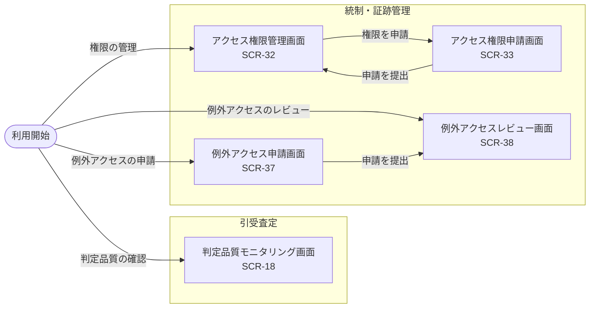

# 業務部門責任者・CSIRT: ACT-12・ACT-17

```mermaid
flowchart LR
    in1(["利用開始"])

    subgraph undw["引受査定"]
        SCR18["判定品質モニタリング画面<br/>SCR-18"]
    end

    subgraph audit["統制・証跡管理"]
        SCR32["アクセス権限管理画面<br/>SCR-32"]
        SCR33["アクセス権限申請画面<br/>SCR-33"]
        SCR37["例外アクセス申請画面<br/>SCR-37"]
        SCR38["例外アクセスレビュー画面<br/>SCR-38"]
    end

    in1 -->|"判定品質の確認"| SCR18
    in1 -->|"権限の管理"| SCR32
    in1 -->|"例外アクセスの申請"| SCR37
    in1 -->|"例外アクセスのレビュー"| SCR38
    SCR32 -->|"権限を申請"| SCR33
    SCR33 -->|"申請を提出"| SCR32
    SCR37 -->|"申請を提出"| SCR38
```

> ⚠️ **要確認**: 以下の遷移は上流に根拠が無いため仮置きしています。
> - 入口(画面一覧に本図のアクターが使う認証の画面が無いため「利用開始」としている)
> - 例外アクセス申請画面から例外アクセスレビュー画面への遷移(承認方式が事前/事後のいずれか未確定: DOM-AUDIT-IRR-6)
