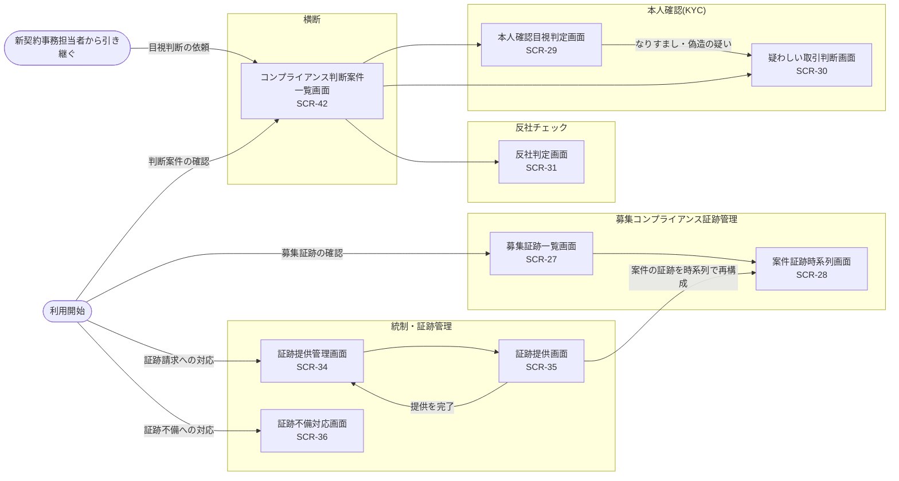

# コンプライアンス部・内部監査部: ACT-15・ACT-16

```mermaid
flowchart LR
    in1(["利用開始"])
    in2(["新契約事務担当者から引き継ぐ"])

    subgraph common["横断"]
        SCR42["コンプライアンス判断案件一覧画面<br/>SCR-42"]
    end

    subgraph suit["募集コンプライアンス証跡管理"]
        SCR27["募集証跡一覧画面<br/>SCR-27"]
        SCR28["案件証跡時系列画面<br/>SCR-28"]
    end

    subgraph kyc["本人確認(KYC)"]
        SCR29["本人確認目視判定画面<br/>SCR-29"]
        SCR30["疑わしい取引判断画面<br/>SCR-30"]
    end

    subgraph asf["反社チェック"]
        SCR31["反社判定画面<br/>SCR-31"]
    end

    subgraph audit["統制・証跡管理"]
        SCR34["証跡提供管理画面<br/>SCR-34"]
        SCR35["証跡提供画面<br/>SCR-35"]
        SCR36["証跡不備対応画面<br/>SCR-36"]
    end

    in1 -->|"判断案件の確認"| SCR42
    in2 -->|"目視判断の依頼"| SCR42
    in1 -->|"募集証跡の確認"| SCR27
    in1 -->|"証跡請求への対応"| SCR34
    in1 -->|"証跡不備への対応"| SCR36

    SCR42 --> SCR29 & SCR30 & SCR31
    SCR29 -->|"なりすまし・偽造の疑い"| SCR30
    SCR27 --> SCR28
    SCR34 --> SCR35
    SCR35 -->|"案件の証跡を時系列で再構成"| SCR28
    SCR35 -->|"提供を完了"| SCR34
```

> ⚠️ **要確認**: 入口は、画面一覧に本図のアクターが使う認証の画面が無いため「利用開始」として仮置きしています。
