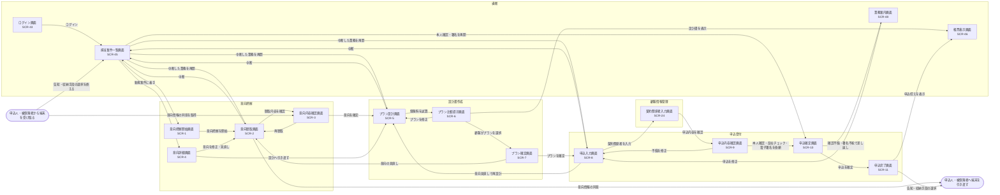

# 募集人: ACT-1・ACT-2

> ⚠️ **要確認**: 以下の遷移は上流に根拠が無いため仮置きしています。
> - 担当案件一覧画面から意向把握開始画面への遷移(新規案件に着手する起点)
> - 申込入力画面から契約関係者入力画面を経て申込内容確認画面へ進む順序(契約関係者の入力を申込受付で行うか)
> - 端末を受け取った後に戻る画面(意向情報の同意は意向内容確認画面、告知・収納手段の選択は担当案件一覧画面としている)
