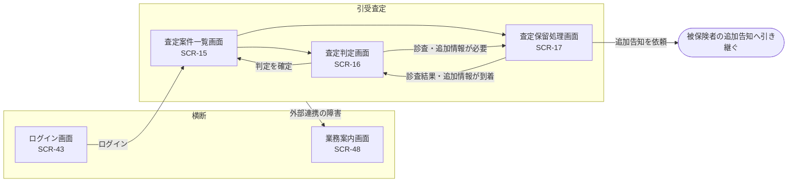

# 引受査定担当者: ACT-3

```mermaid
flowchart LR
    subgraph common["横断"]
        SCR43["ログイン画面<br/>SCR-43"]
        SCR48["業務案内画面<br/>SCR-48"]
    end

    subgraph undw["引受査定"]
        SCR15["査定案件一覧画面<br/>SCR-15"]
        SCR16["査定判定画面<br/>SCR-16"]
        SCR17["査定保留処理画面<br/>SCR-17"]
    end

    out1(["被保険者の追加告知へ引き継ぐ"])

    SCR43 -->|"ログイン"| SCR15
    SCR15 --> SCR16 & SCR17
    SCR16 -->|"診査・追加情報が必要"| SCR17
    SCR17 -->|"診査結果・追加情報が到着"| SCR16
    SCR16 -->|"判定を確定"| SCR15
    SCR17 -->|"追加告知を依頼"| out1
    undw -->|"外部連携の障害"| SCR48
```

> ⚠️ **要確認**: 引受査定の画面から業務案内画面への遷移は、引受査定要求仕様書に外部連携の障害によるイレギュラーの定義が無いため仮置きしています。
