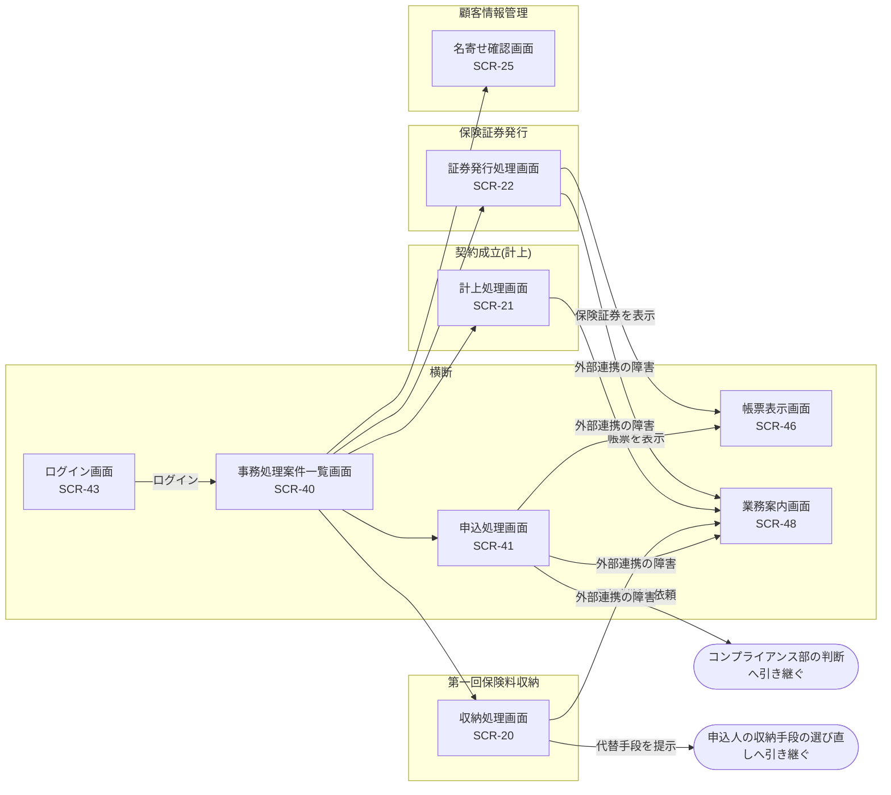

# 新契約事務担当者: ACT-4

```mermaid
flowchart LR
    subgraph common["横断"]
        SCR43["ログイン画面<br/>SCR-43"]
        SCR40["事務処理案件一覧画面<br/>SCR-40"]
        SCR41["申込処理画面<br/>SCR-41"]
        SCR46["帳票表示画面<br/>SCR-46"]
        SCR48["業務案内画面<br/>SCR-48"]
    end

    subgraph prem["第一回保険料収納"]
        SCR20["収納処理画面<br/>SCR-20"]
    end

    subgraph book["契約成立(計上)"]
        SCR21["計上処理画面<br/>SCR-21"]
    end

    subgraph plcy["保険証券発行"]
        SCR22["証券発行処理画面<br/>SCR-22"]
    end

    subgraph cust["顧客情報管理"]
        SCR25["名寄せ確認画面<br/>SCR-25"]
    end

    out1(["コンプライアンス部の判断へ引き継ぐ"])
    out2(["申込人の収納手段の選び直しへ引き継ぐ"])

    SCR43 -->|"ログイン"| SCR40
    SCR40 --> SCR41 & SCR20 & SCR21 & SCR22 & SCR25
    SCR41 -->|"目視判断を依頼"| out1
    SCR41 -->|"帳票を表示"| SCR46
    SCR20 -->|"代替手段を提示"| out2
    SCR22 -->|"保険証券を表示"| SCR46
    SCR41 & SCR20 & SCR21 & SCR22 -->|"外部連携の障害"| SCR48
```

> ⚠️ **要確認**: 事務処理案件一覧画面から証券発行処理画面への遷移は、事務処理案件一覧画面の画面概要に証券発行の滞留要因が無いため仮置きしています。
