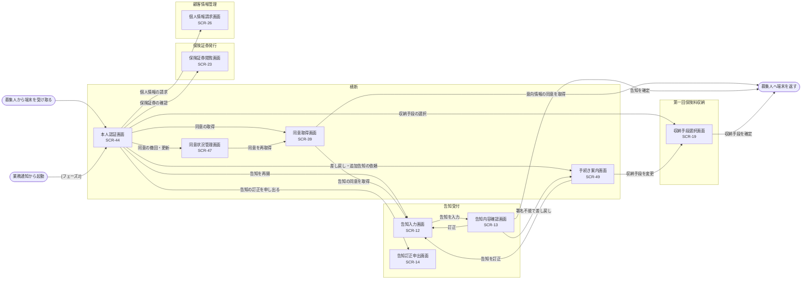

# 申込人・被保険者: ACT-5・ACT-6

```mermaid
flowchart LR
    in1(["募集人から端末を受け取る"])
    in2(["業務通知から起動"])

    subgraph common["横断"]
        SCR44["本人認証画面<br/>SCR-44"]
        SCR39["同意取得画面<br/>SCR-39"]
        SCR47["同意状況管理画面<br/>SCR-47"]
        SCR49["手続き案内画面<br/>SCR-49"]
    end

    subgraph decl["告知受付"]
        SCR12["告知入力画面<br/>SCR-12"]
        SCR13["告知内容確認画面<br/>SCR-13"]
        SCR14["告知訂正申出画面<br/>SCR-14"]
    end

    subgraph prem["第一回保険料収納"]
        SCR19["収納手段選択画面<br/>SCR-19"]
    end

    subgraph plcy["保険証券発行"]
        SCR23["保険証券閲覧画面<br/>SCR-23"]
    end

    subgraph cust["顧客情報管理"]
        SCR26["個人情報請求画面<br/>SCR-26"]
    end

    out1(["募集人へ端末を返す"])

    in1 --> SCR44
    in2 -->|"[フェーズ2]"| SCR44
    SCR44 -->|"同意の取得"| SCR39
    SCR44 -->|"告知を再開"| SCR12
    SCR44 -->|"告知の訂正を申し出る"| SCR14
    SCR44 -->|"収納手段の選択"| SCR19
    SCR44 -->|"保険証券の確認"| SCR23
    SCR44 -->|"個人情報の請求"| SCR26
    SCR44 -->|"同意の撤回・更新"| SCR47
    SCR44 -->|"差し戻し・追加告知の依頼"| SCR49

    SCR39 -->|"告知の同意を取得"| SCR12
    SCR39 -->|"意向情報の同意を取得"| out1
    SCR47 -->|"同意を再取得"| SCR39

    SCR12 -->|"告知を入力"| SCR13
    SCR13 -->|"訂正"| SCR12
    SCR13 -->|"署名不能で差し戻し"| SCR49
    SCR13 -->|"告知を確定"| out1
    SCR49 -->|"告知を訂正"| SCR12
    SCR49 -->|"収納手段を変更"| SCR19
    SCR19 -->|"収納手段を確定"| out1
```

> ⚠️ **要確認**: 以下の遷移は上流に根拠が無いため仮置きしています。
> - 本人認証画面から同意取得画面を経て告知入力画面へ進む順序
> - 告知と収納手段の選択の前後関係(それぞれ募集人へ端末を返す形としている)
> - フェーズ1 での告知訂正申出画面・保険証券閲覧画面・個人情報請求画面・同意状況管理画面への利用経路
