# C4モデル レベル2: コンテナ

本図は、C4モデル レベル1 の対象システム「個人保険新契約システム」の内部を、独立して実行・デプロイされるコンテナ単位で描いたものです。人・外部システムとその括りは C4モデル レベル1 に従っており、各要素の定義はレベル1 §登場要素を参照してください。業務サービスは工程間の引き渡しを境界に分け、引き渡しを非同期とすることで、1 つのサービスが止まっても他の業務を続けられるようにしています。各業務サービスは専有のデータ(データベース・ファイル)を持ち、図では省略しています。「新契約の業務工程」の囲みに出入りする線は、囲みの中の各サービスとのやり取りをまとめて表しています。

```mermaid
flowchart LR
    classDef person fill:#08427b,color:#ffffff,stroke:#052e56;
    classDef container fill:#438dd5,color:#ffffff,stroke:#2e6295;
    classDef extsys fill:#8c8c8c,color:#ffffff,stroke:#5c5c5c;

    subgraph zNai["Sample生命保険(社内・直接利用)"]
        direction TB
        act1["社内営業職員<br/>ACT-1"]
        act3["引受査定担当者<br/>ACT-3"]
        act4["新契約事務担当者<br/>ACT-4"]
    end

    subgraph zTosei["社内・統制/運用"]
        direction TB
        act12["業務部門責任者<br/>ACT-12"]
        act15["コンプライアンス部<br/>ACT-15"]
        act16["内部監査部<br/>ACT-16"]
        act17["CSIRT<br/>ACT-17"]
    end

    subgraph zGai["社外"]
        direction TB
        act2["代理店募集人<br/>ACT-2"]
        act5["申込人(契約者)<br/>ACT-5"]
        act6["被保険者<br/>ACT-6"]
    end

    subgraph sys["個人保険新契約システム"]
        direction TB
        cnt1["<b>募集人用SPA</b><br/>CNT-1"]
        cnt2["<b>募集人用BFF</b><br/>CNT-2"]
        cnt3["<b>社内業務用SPA</b><br/>CNT-3"]
        cnt4["<b>社内業務用BFF</b><br/>CNT-4"]
        cnt5["<b>申込人・被保険者用SPA</b><br/>CNT-5"]
        cnt6["<b>申込人・被保険者用BFF</b><br/>CNT-6"]
        subgraph svc["新契約の業務工程"]
            direction TB
            cnt7["<b>意向把握・設計サービス</b><br/>CNT-7"]
            cnt8["<b>申込受付サービス</b><br/>CNT-8"]
            cnt9["<b>告知受付サービス</b><br/>CNT-9"]
            cnt10["<b>本人確認・反社・署名<br/>サービス</b><br/>CNT-10"]
            cnt11["<b>引受査定サービス</b><br/>CNT-11"]
            cnt12["<b>初回保険料収納サービス</b><br/>CNT-12"]
            cnt13["<b>契約成立・証券発行<br/>サービス</b><br/>CNT-13"]
        end
        cnt14["<b>監査・証跡管理サービス</b><br/>CNT-14"]
        cnt15["<b>[フェーズ2]<br/>査定予測サービス</b><br/>CNT-15"]
        cnt16["<b>業務通知サービス</b><br/>CNT-16"]
    end

    subgraph zJisha["自社別システム"]
        direction TB
        ext1["商品マスタ管理システム<br/>EXT-1"]
        ext2["募集人管理システム<br/>EXT-2"]
        ext3["契約管理システム<br/>EXT-3"]
        ext4["収納システム<br/>EXT-4"]
        ext5["帳票発送システム<br/>EXT-5"]
    end

    subgraph zSvc["外部サービス"]
        direction TB
        ext6["本人確認(eKYC)サービス<br/>EXT-6"]
        ext7["反社チェックサービス<br/>EXT-7"]
        ext8["電子署名サービス<br/>EXT-8"]
        ext9["決済サービス<br/>EXT-9"]
    end

    act1 -->|"意向把握・設計・<br/>申込の操作<br/>(同期)"| cnt1
    act2 -->|"意向把握・設計・<br/>申込の操作<br/>(同期)"| cnt1
    act3 -->|"引受査定の操作<br/>(同期)"| cnt3
    act4 -->|"収納確認・計上・<br/>証券発行の操作<br/>(同期)"| cnt3
    zTosei -->|"権限統制・証跡提示・<br/>目視判断の操作<br/>(同期)"| cnt3
    act5 -->|"同意・払込・署名・<br/>証券の受け取り<br/>(同期)"| cnt5
    act6 -->|"告知入力・同意・<br/>署名の操作<br/>(同期)"| cnt5

    cnt1 -->|"画面の操作を渡し<br/>表示内容を受け取る<br/>(同期)"| cnt2
    cnt3 -->|"画面の操作を渡し<br/>表示内容を受け取る<br/>(同期)"| cnt4
    cnt5 -->|"画面の操作を渡し<br/>表示内容を受け取る<br/>(同期)"| cnt6

    cnt2 -->|"意向把握・設計の操作<br/>(同期)"| cnt7
    cnt2 -->|"申込入力・関係者の<br/>入力操作<br/>(同期)"| cnt8
    cnt2 -->|"本人確認・反社照合・<br/>再署名の依頼<br/>(同期)"| cnt10
    cnt2 -->|"通知設定・履歴の<br/>参照<br/>(同期)"| cnt16
    cnt2 -->|"認証イベントを渡す<br/>(非同期)"| cnt14

    cnt4 -->|"停留申込の収束・<br/>名寄せの操作<br/>(同期)"| cnt8
    cnt4 -->|"目視判断・再依頼・<br/>反社判断の操作<br/>(同期)"| cnt10
    cnt4 -->|"査定・基準調整の操作<br/>(同期)"| cnt11
    cnt4 -->|"収納確認・収束の操作<br/>(同期)"| cnt12
    cnt4 -->|"計上・証券発行の操作<br/>(同期)"| cnt13
    cnt4 -->|"証跡提示・権限統制の<br/>操作(同期)、<br/>認証イベント(非同期)"| cnt14
    cnt4 -->|"通知設定・履歴の<br/>参照<br/>(同期)"| cnt16

    cnt6 -->|"意向情報取得の<br/>同意<br/>(同期)"| cnt7
    cnt6 -->|"同意管理・個人情報<br/>請求の操作<br/>(同期)"| cnt8
    cnt6 -->|"告知の入力・確定・<br/>訂正の操作<br/>(同期)"| cnt9
    cnt6 -->|"電子署名の操作<br/>(同期)"| cnt10
    cnt6 -->|"保険料払込の操作<br/>(同期)"| cnt12
    cnt6 -->|"電子交付の証券を<br/>受け取る<br/>(同期)"| cnt13
    cnt6 -->|"通知設定・履歴の<br/>参照<br/>(同期)"| cnt16
    cnt6 -->|"認証イベントを渡す<br/>(非同期)"| cnt14

    cnt7 -->|"確定プラン・確定意向を<br/>引き渡す<br/>(非同期)"| cnt8
    cnt8 -->|"申込確定・同意撤回を<br/>渡す<br/>(非同期)"| cnt9
    cnt8 -->|"契約関係者・申込書の<br/>確認を依頼する<br/>(非同期)"| cnt10
    cnt9 -->|"告知書の署名を<br/>依頼する<br/>(非同期)"| cnt10
    cnt10 -->|"本人確認・反社・署名の<br/>結果を渡す<br/>(非同期)"| cnt8
    cnt10 -->|"告知書の署名結果を<br/>渡す<br/>(非同期)"| cnt9
    cnt8 -->|"収納を依頼する<br/>(非同期)"| cnt12
    cnt8 -->|"確定顧客情報・<br/>申込撤回を渡す<br/>(非同期)"| cnt13
    cnt9 -->|"確定告知・訂正を<br/>引き渡す<br/>(非同期)"| cnt11
    cnt11 -->|"追加告知を<br/>照会する<br/>(非同期)"| cnt9
    cnt11 -->|"特別条件を渡す<br/>(非同期)"| cnt12
    cnt11 -->|"査定結果を<br/>引き渡す<br/>(非同期)"| cnt13
    cnt12 -->|"収納結果・責任開始日を<br/>引き渡す<br/>(非同期)"| cnt13
    cnt11 -->|"査定データを渡し<br/>予測を受け取る<br/>(同期)"| cnt15
    svc -->|"証跡・監査イベントを<br/>渡す<br/>(非同期)"| cnt14
    svc -->|"節目イベントを渡す<br/>(非同期)"| cnt16

    cnt7 -->|"商品取扱可否・<br/>保険料試算を照会<br/>(同期)"| ext1
    cnt7 -->|"募集権限を照会<br/>(同期)"| ext2
    cnt11 -->|"引受基準を照会・<br/>改定を反映<br/>(同期)"| ext1
    cnt10 -->|"取引時確認を依頼<br/>(同期)"| ext6
    cnt10 -->|"反社照合を依頼<br/>(同期)"| ext7
    cnt10 -->|"電子署名・真実性<br/>措置を依頼<br/>(同期)"| ext8
    cnt12 -->|"収納・返金を依頼<br/>(同期)"| ext9
    cnt13 -->|"計上・確定顧客情報を<br/>連携<br/>(同期)"| ext3
    cnt13 -->|"成立契約を継続収納へ<br/>引き渡す<br/>(同期)"| ext4
    cnt13 -->|"証券・帳票の<br/>発送を連携<br/>(同期)"| ext5

    cnt13 ~~~ ext6
    cnt13 ~~~ ext1
    cnt14 ~~~ cnt16

    class act1,act2,act3,act4,act5,act6,act12,act15,act16,act17 person;
    class cnt1,cnt2,cnt3,cnt4,cnt5,cnt6,cnt7,cnt8,cnt9,cnt10,cnt11,cnt12,cnt13,cnt14,cnt15,cnt16 container;
    class ext1,ext2,ext3,ext4,ext5,ext6,ext7,ext8,ext9 extsys;
    style sys fill:none,stroke:#1168bd,stroke-width:2px,stroke-dasharray:6 4;
    style svc fill:none,stroke:#438dd5,stroke-width:1px;
```

> ⚠️ **要確認**: ADR が未作成のため、図中の連携方式(同期/非同期)はレベル1 シーケンスを根拠とした設計提案です。収納システム(EXT-4)への引き渡しは、対応するレベル1 シーケンスが無いため仮置きです。

## コンテナ

| ID | 種別 | 名称 | 責務 | 設計根拠 | 関連 UC |
|---|---|---|---|---|---|
| CNT-1 | SPA | 募集人用SPA | 社内営業職員・代理店募集人が意向把握・設計・申込入力・本人確認/反社照合の依頼を行う画面を、ブラウザ上で提供する | 募集人の業務は顧客の前で行うため、社内の査定・事務が止まっても続けられるよう社内業務用と分ける【要確認】 | UC-1〜12, UC-39, UC-47, UC-51, UC-59, UC-67〜70, UC-72〜73 |
| CNT-2 | BFF | 募集人用BFF | 募集人用SPAからの操作を受け、ログイン・中断業務の再開・次行動の提示を行い、意向把握・設計、申込受付、本人確認・反社・署名、業務通知の各サービスへ振り分ける。認証イベントを監査・証跡管理サービスへ渡す | ブラウザで動く SPA とは実行場所が異なるため分ける。中継を募集人の利用に閉じ、他の利用者向けの障害を受けないようにする(UC-67, UC-69, UC-73)【要確認】 | UC-1〜12, UC-39, UC-47, UC-51, UC-59, UC-67〜70, UC-72〜73 |
| CNT-3 | SPA | 社内業務用SPA | 引受査定担当者・新契約事務担当者・統制部門が査定・収納確認・計上・証券発行・目視判断・証跡提示を行う画面を、ブラウザ上で提供する | 査定・事務・統制は社内の後続業務であり、募集の画面と障害を分け合わないよう分ける【要確認】 | UC-13, UC-18〜24, UC-26〜38, UC-40, UC-43〜46, UC-48〜55, UC-57〜68, UC-70, UC-72〜73 |
| CNT-4 | BFF | 社内業務用BFF | 社内業務用SPAからの操作を受け、ログイン・次行動の提示を行い、申込受付、本人確認・反社・署名、引受査定、初回保険料収納、契約成立・証券発行、監査・証跡管理、業務通知の各サービスへ振り分ける | ブラウザで動く SPA とは実行場所が異なるため分ける。中継を社内業務の利用に閉じ、募集・社外向けの障害を受けないようにする(UC-67, UC-73)【要確認】 | UC-13, UC-18〜24, UC-26〜38, UC-40, UC-43〜46, UC-48〜55, UC-57〜68, UC-70, UC-72〜73 |
| CNT-5 | SPA | 申込人・被保険者用SPA | 申込人・被保険者本人が同意・告知入力・電子署名・保険料払込・電子交付された証券の受け取り【要確認: フェーズ1で電子交付を本人端末で受け取るか、物理交付に限るか】・個人情報請求を行う画面を、ブラウザ上で提供する。対面営業では、募集人のタブレット上で本人確認のうえ開く。リモート営業では、発行したお客さま用 URL から本人の端末で開き、告知入力などを行う【要確認: PRD §利用形態では本人端末での利用はフェーズ2】 | 本人しか行えない操作(UC-14 告知の本人入力 等)の経路を、募集人の操作と分ける。対面・リモートのどちらでも同じ SPA を使い、端末だけが変わる【要確認】 | UC-3, UC-14〜17, UC-25, UC-36, UC-41〜42, UC-56, UC-67〜69, UC-71, UC-73 |
| CNT-6 | BFF | 申込人・被保険者用BFF | 申込人・被保険者用SPAからの操作を受け、お客さま用 URL からのアクセスを含めて本人認証を行い、中断業務の再開・次行動の提示を行い、意向把握・設計、申込受付、告知受付、本人確認・反社・署名、初回保険料収納、契約成立・証券発行、業務通知の各サービスへ振り分ける。認証イベントを監査・証跡管理サービスへ渡す | ブラウザで動く SPA とは実行場所が異なるため分ける。本人の操作の入口をこの中継に限り、募集人・社内向けの中継と分ける(UC-14, UC-67, UC-69, UC-73)【要確認】 | UC-3, UC-14〜17, UC-25, UC-36, UC-41〜42, UC-56, UC-67〜69, UC-71, UC-73 |
| CNT-7 | 業務サービス | 意向把握・設計サービス | 意向の聴取・確定と設計プランの構成・試算・比較を行い、確定プランを申込受付サービスへ引き渡す | 設計から申込への引き渡し(UC-9)を境界とし、申込受付が止まっても意向把握・設計を続けられるようにする【要確認】 | UC-1〜9 |
| CNT-8 | 業務サービス | 申込受付サービス | 申込項目の入力・検証、関係者整合、確認結果の待ち合わせによる申込確定、停留申込の収束を行う。契約主体・顧客情報と本人同意を管理する | 申込確定(UC-12)を境界に告知受付・収納へ引き渡す。契約主体の入力(UC-39)と同意の撤回(UC-41)は申込手続きに直結するため同じサービスに置く【要確認】 | UC-10〜13, UC-39〜42, UC-71 |
| CNT-9 | 業務サービス | 告知受付サービス | 被保険者本人による告知の入力・健康情報の取得同意・確定・訂正を受け付け、確定告知を引受査定サービスへ引き渡す | 告知は申込確定を受けて被保険者本人が行う手続き(UC-14)であり、確定告知の引き渡し(UC-16)を境界とする【要確認】 | UC-14〜17 |
| CNT-10 | 業務サービス | 本人確認・反社・署名サービス | 本人確認・反社照合・電子署名を外部サービスへ依頼し、不達時の再依頼・目視判断・再署名を含めて結果を確定させ、申込受付・告知受付へ渡す | 外部サービスへの依頼と結果待ちが続く業務をまとめ、外部サービスの障害を申込入力・告知入力へ波及させない(UC-48, UC-72)【要確認】 | UC-47〜59, UC-72 |
| CNT-11 | 業務サービス | 引受査定サービス | 確定告知を根拠に査定経路の振り分け・自動判定・医的査定・査定イレギュラーの収束・基準調整を行い、査定結果を契約成立・証券発行サービスへ引き渡す | 確定告知の受領(UC-18)と査定結果の引き渡し(UC-20, UC-21)を境界とし、査定が滞っても申込・告知の受付を止めない【要確認】 | UC-18〜24 |
| CNT-12 | 業務サービス | 初回保険料収納サービス | 収納手段・金額の確定、収納成立の検知、責任開始日の確定、収納不成立の収束と二重収納の防止を行い、収納結果を契約成立・証券発行サービスへ引き渡す | 払込は申込人の操作で発生し(UC-25)、計上・証券発行の都合で止めないよう分ける【要確認】 | UC-25〜29, UC-72 |
| CNT-13 | 業務サービス | 契約成立・証券発行サービス | 査定可決と収納成立の双方充足を検知して計上し、契約管理システム・収納システムへ引き渡したうえで、保険証券を生成・交付する | 前工程の結果を受けて新契約事務担当者が行う後続業務であり(UC-30, UC-31)、既存システムとの連携障害を前工程へ波及させない【要確認】 | UC-30〜38, UC-70, UC-72 |
| CNT-14 | 業務サービス | 監査・証跡管理サービス | 各業務サービスから証跡・監査イベントを受け取って改ざん不能に 10 年保全し、欠落検証・時系列提示・権限統制・例外アクセス統制を行う | 監査対象イベントを業務処理とは別系統で全件追跡する(UC-62)ため独立させる。止まっても業務は続け、イベントは復旧後に保全する【要確認】 | UC-4, UC-9, UC-12, UC-16〜18, UC-43〜46, UC-55, UC-60〜67 |
| CNT-15 | 業務サービス | [フェーズ2] 査定予測サービス | 蓄積された申込・引受・成立データから自動判定の精度指標と医的査定要否の予測を算定する | 精度算定・予測(UC-24)は計算負荷の特性が他の業務と大きく異なるため、引受査定サービスから切り出す【要確認】 | UC-24 |
| CNT-16 | 非同期処理 | 業務通知サービス | 各業務サービスの節目イベントを受け取り、利用者種別ごとに業務通知を配信・再送する | 配信と再送を業務から切り離し、通知の障害で業務を止めない(UC-68)【要確認】 | UC-4, UC-9, UC-12〜13, UC-16, UC-20〜22, UC-25〜26, UC-31, UC-36, UC-59, UC-68 |
